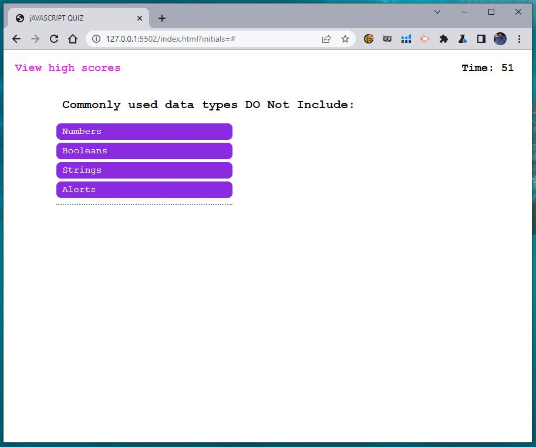

# JavaScript Quiz

## Description

This website has been created to test your knowledge about basic concepts from JavaScript

## Installation

N/A

## Usage

To use this page simply click on the start button, the timer will initiate and the first question will show. you have 1 minute to answer all the questions. When answer correctly you will be shown the next question. If answered wrong it will affect your score and 10 seconds will be deducted from the reaimend time. Once the time is down ot 0 the quiz will be over and you will be shown your score and will be ask to intruduce your initials. You can see the high scores by clicking on the top ledt corner link. Good Luck!

The deployment application link is https://gmontano79.github.io/jsquiz/

## Welcome page

## Questions pages

## When quizz is over

## High Scores Table

## Clean High scores table

## Credits

N/A

## License

Please refer to the LICENSE in the repo.
